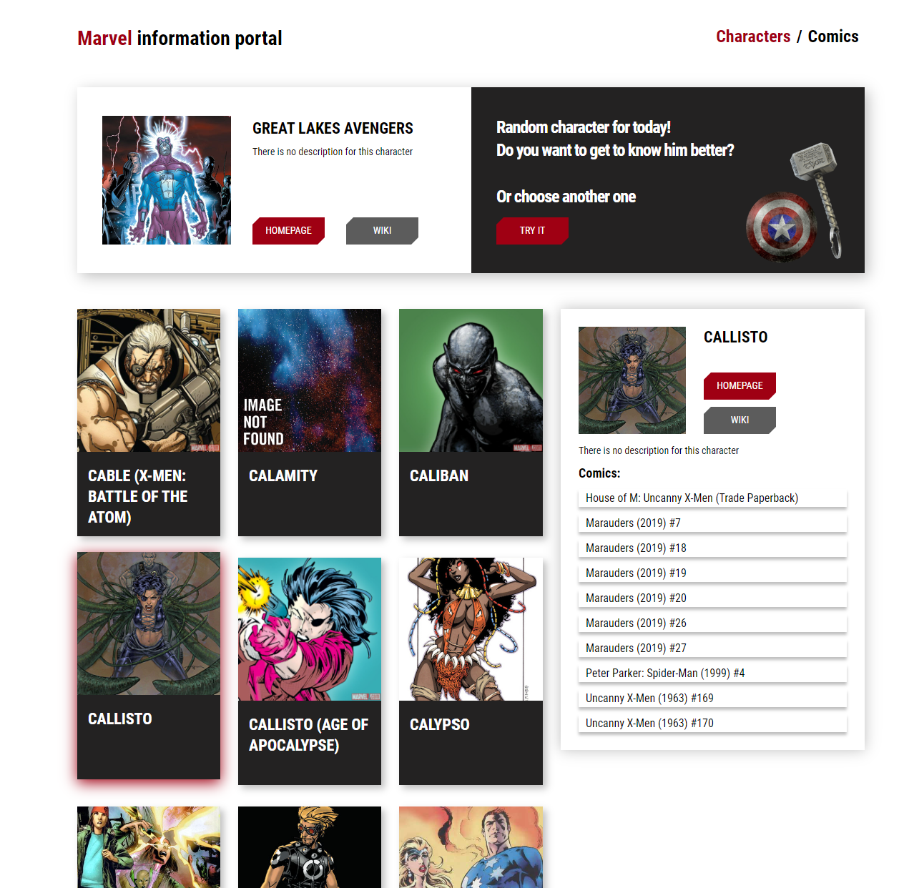
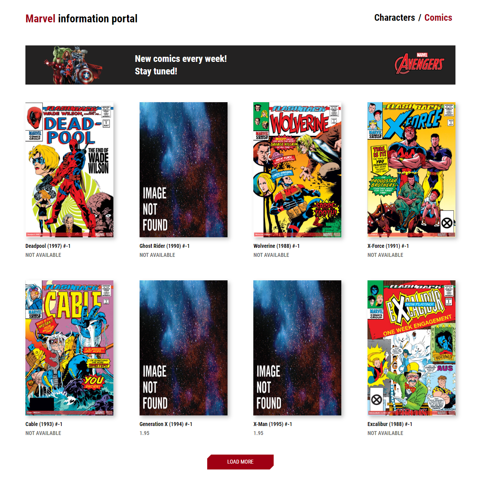
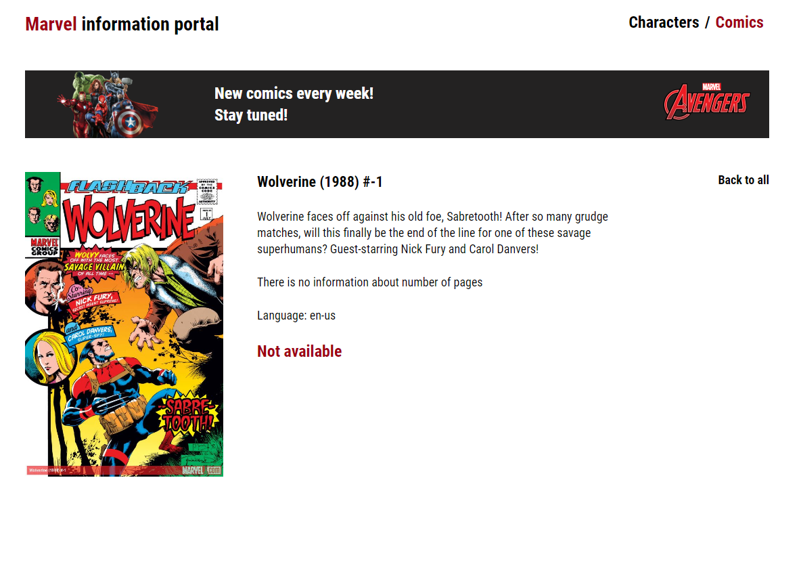

# Marvel Information Portal App

## Table of content

&nbsp;&nbsp;&nbsp; [About Project](#about-project)\
&nbsp;&nbsp;&nbsp; [Screenshots](#screenshots)\
&nbsp;&nbsp;&nbsp; [Technologies Used](#technologies-used)\
&nbsp;&nbsp;&nbsp; [Prerequisites](#prerequisites)\
&nbsp;&nbsp;&nbsp; [Installation](#installation)\
&nbsp;&nbsp;&nbsp; [Usage](#usage)\
&nbsp;&nbsp;&nbsp; [Acknowledgments](#acknowledgments)

## About Project

This is a React-based web application that displays Marvel characters and Marvel Comics dynamically created from [Marvel API](https://developer.marvel.com/)
The app contains three pages:

-   page with characters
-   page with all comics
-   page with a single comic

## Screenshots:

### Page with characters

### Page with all comics

### Page with a single comic

## Technologies Used:

-   React.js
-   SCSS
-   React-Router

## Prerequisites

You will need to have Node.js and npm installed on your machine.

## Installation

To get started with this project, follow the steps below:

1. Clone the repository to your local machine:\
   &nbsp;&nbsp;&nbsp;&nbsp;&nbsp;&nbsp; `git clone https://github.com/yshvchnk/React.js-MarvelInfoPortal.git`

2. Navigate to the project directory:\
   &nbsp;&nbsp;&nbsp;&nbsp;&nbsp;&nbsp; `cd MarvelInfoPortal`

3. Install dependencies:\
   &nbsp;&nbsp;&nbsp;&nbsp;&nbsp;&nbsp; `npm install`

4. Get your Marvel API key on [Marvel API](https://developer.marvel.com/) and insert it in **MarvelService.js**

5. Start the development server:\
   &nbsp;&nbsp;&nbsp;&nbsp;&nbsp;&nbsp; `npm start`

## Usage

Once you have started the development server, open a web browser and navigate to localhost to view the application:\
[http://localhost:3000](http://localhost:3000)

The page will reload when you make changes.\
You may also see any lint errors in the console.

## Acknowledgments

This project was made possible by the API provided by [Marvel API](https://developer.marvel.com/)\
This project was bootstrapped with [Create React App](https://github.com/facebook/create-react-app).
